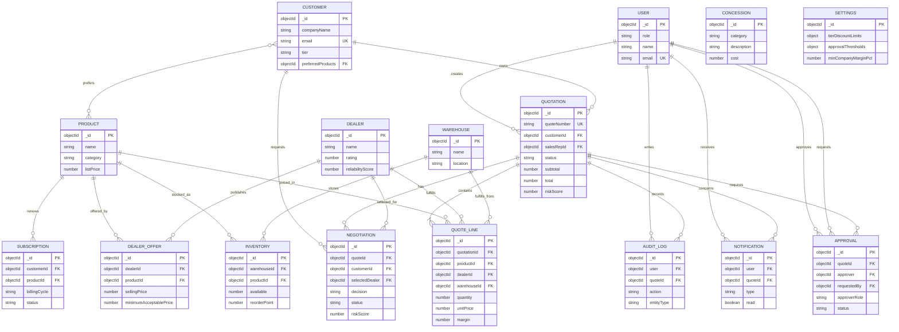
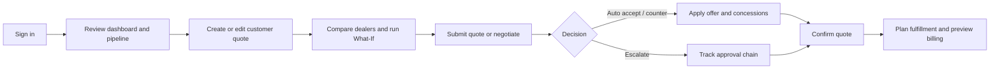
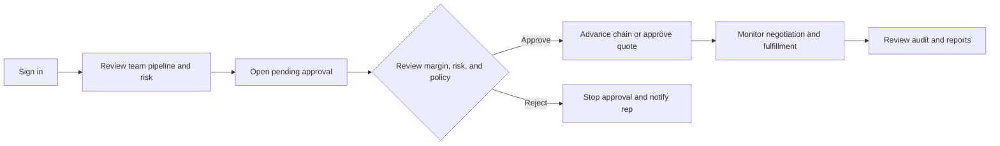
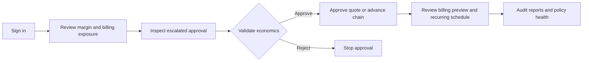
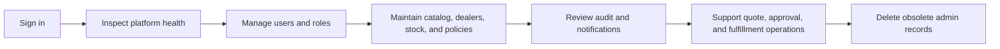
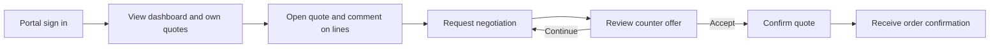

# DealFlow360 — Autonomous Deal Optimization Platform

A full-stack MERN **B2B Sales Operations** platform whose hero feature is a **Profit-Aware Multi-Dealer Negotiation Engine**. Instead of finding the cheapest price, it searches for the deal that is **best and mutually profitable** — maximizing *Customer value × Dealer profit × Company (DealFlow360) margin* — while gate-keeping risk with autonomous approvals, What-If simulation, warehouse fulfillment and hybrid (one-time + subscription) billing.

## Differentiator in one line

> The negotiation engine never accepts a price that pushes a dealer below minimum profit, the company below minimum margin, or a discount beyond policy — it returns `AUTO_ACCEPT`, a `COUNTER_OFFER` (with value-add concessions), `ESCALATE`, or `REJECT` accordingly, backed by a live per-dealer scorecard.

---

## Stack

| Layer | Tech |
|---|---|
| Frontend | Vite + React 18 + Tailwind + Zustand + React Router + Recharts + Lucide |
| Backend | Express + Mongoose (ESM), JWT auth |
| Database | MongoDB (local; DB name `dealflow360`) |
| Demo | Rep console on **:5174**, Customer portal at `/portal`, API on **:5001** |

Port **5001** is used because macOS `ControlCenter` occupies :5000. `client/vite.config.js` proxies `/api` → `http://localhost:5001`, and the server CORS whitelists `http://localhost:5174`.

---

## Quick start

```bash
# 1. start MongoDB (brew services start mongodb-community)
# 2. install everything
npm run setup

# 3. seed demo data (users, customers, products, dealers, offers,
#    warehouses, inventory, subscriptions, concessions, hero quote)
cp server/.env.example server/.env
npm run seed

# 4. run both servers (API on 5001, UI on 5174)
npm run dev
```

Then open:
- **Internal console** → http://localhost:5174
- **Customer portal** → http://localhost:5174/portal

> Current `server/.env` already configures `PORT=5001` and `CLIENT_URL=http://localhost:5174`.

---

## Demo accounts

### Internal console (click-to-fill on the sign-in screen)

| Role | Email | Password |
|---|---|---|
| Sales Rep | `rep@dealflow360.com` | `Rep@123` |
| Sales Manager | `manager@dealflow360.com` | `Manager@123` |
| Finance | `finance@dealflow360.com` | `Finance@123` |
| Admin | `admin@dealflow360.com` | `Admin@123` |

### Customer portal

| Company | Email | Password |
|---|---|---|
| Acme Corp (Gold) | `acme@acme.com` | `Acme@123` |
| Beta Industries (Silver) | `beta@beta.com` | `Beta@123` |
| Nova Labs (Platinum) | `nova@nova.com` | `Nova@123` |
| Zenith Pharma (Bronze) | `zenith@zenith.com` | `Zenith@123` |

### Complete role-classified test credentials

The following accounts are available after the normal demo seed and the system-test data generator. These are local development/test credentials only and must not be reused in production.

#### Internal Sales Representatives (`SALES_REP`)

| Account | Email | Password |
|---|---|---|
| Demo Sales Rep | `rep@dealflow360.com` | `Rep@123` |
| System Test Rep 1 | `system-test-user-1@example.com` | `SystemTest@123` |
| System Test Rep 5 | `system-test-user-5@example.com` | `SystemTest@123` |
| System Test Rep 9 | `system-test-user-9@example.com` | `SystemTest@123` |
| System Test Rep 13 | `system-test-user-13@example.com` | `SystemTest@123` |
| System Test Rep 17 | `system-test-user-17@example.com` | `SystemTest@123` |

Pattern: `system-test-user-1`, `5`, `9`, `13`, and `17` are the five generated Sales Rep accounts.

#### Sales Managers (`SALES_MANAGER`)

| Account | Email | Password |
|---|---|---|
| Demo Sales Manager | `manager@dealflow360.com` | `Manager@123` |
| System Test Manager 2 | `system-test-user-2@example.com` | `SystemTest@123` |
| System Test Manager 6 | `system-test-user-6@example.com` | `SystemTest@123` |
| System Test Manager 10 | `system-test-user-10@example.com` | `SystemTest@123` |
| System Test Manager 14 | `system-test-user-14@example.com` | `SystemTest@123` |
| System Test Manager 18 | `system-test-user-18@example.com` | `SystemTest@123` |

Pattern: `system-test-user-2`, `6`, `10`, `14`, and `18` are the five generated Sales Manager accounts.

#### Finance users (`FINANCE`)

| Account | Email | Password |
|---|---|---|
| Demo Finance User | `finance@dealflow360.com` | `Finance@123` |
| System Test Finance 3 | `system-test-user-3@example.com` | `SystemTest@123` |
| System Test Finance 7 | `system-test-user-7@example.com` | `SystemTest@123` |
| System Test Finance 11 | `system-test-user-11@example.com` | `SystemTest@123` |
| System Test Finance 15 | `system-test-user-15@example.com` | `SystemTest@123` |
| System Test Finance 19 | `system-test-user-19@example.com` | `SystemTest@123` |

Pattern: `system-test-user-3`, `7`, `11`, `15`, and `19` are the five generated Finance accounts.

#### Administrators (`ADMIN`)

| Account | Email | Password |
|---|---|---|
| Demo Admin | `admin@dealflow360.com` | `Admin@123` |
| System Test Admin 4 | `system-test-user-4@example.com` | `SystemTest@123` |
| System Test Admin 8 | `system-test-user-8@example.com` | `SystemTest@123` |
| System Test Admin 12 | `system-test-user-12@example.com` | `SystemTest@123` |
| System Test Admin 16 | `system-test-user-16@example.com` | `SystemTest@123` |
| System Test Admin 20 | `system-test-user-20@example.com` | `SystemTest@123` |

Pattern: `system-test-user-4`, `8`, `12`, `16`, and `20` are the five generated Admin accounts.

#### Customer portal users (`CUSTOMER`)

All 40 generated customer accounts use the same password and email sequence:

| Account range | Email pattern | Password | Role |
|---|---|---|---|
| System Test Customers 1–40 | `system-test-customer-1@example.com` through `system-test-customer-40@example.com` | `SystemTest@123` | Customer portal |

Example customer login: `system-test-customer-1@example.com` / `SystemTest@123`.

#### Credential summary

| Classification | Demo accounts | Generated accounts | Login endpoint |
|---|---:|---:|---|
| `SALES_REP` | 1 | 5 | `POST /api/auth/login` |
| `SALES_MANAGER` | 1 | 5 | `POST /api/auth/login` |
| `FINANCE` | 1 | 5 | `POST /api/auth/login` |
| `ADMIN` | 1 | 5 | `POST /api/auth/login` |
| `CUSTOMER` | 4 | 40 | `POST /api/auth/customer/login` |

Internal accounts use the internal console. Customer accounts must use the customer portal login; a customer token cannot be used for internal APIs. Generated passwords are stored as bcrypt hashes in MongoDB, not as plaintext.

---

## The 10-minute hero demo

1. **Login as Sales Rep** (`rep@dealflow360.com` / `Rep@123`).
2. **Dashboard** shows pipeline value ~₹29L, one at-risk deal, recent negotiation rounds.
3. Open **Quotations** → the **Acme hero quote** (20 × Business Laptop, subtotal ₹10,00,000, total ₹11,80,000 incl. GST, stage = Negotiation).
4. **Dealer comparison** — see Global Devices ⭐ recommended (weighted score, not just cheapest; TechSource is ₹500 cheaper but loses on reliability/delivery/inventory).
5. **What-If Simulator** → apply **20%** discount → risk 115.7, chain Manager → Finance, and the engine suggests a preservation play.
6. **Negotiation panel** → request **₹9,00,000**. Engine returns `COUNTER_OFFER` **₹9,20,000 + Free Installation + Priority Delivery** — customer saves ₹80,000, dealer profits ₹70,000, company profits ₹120,000, decision is *mutually* optimal.
7. **Customer portal** (`acme@acme.com` / `Acme@123`) → open the quote → **Accept this offer** → order confirmed.
8. Back in the console: **Fulfillment planner** splits 20 laptops as **Main Warehouse 15 + East Depot 5**, zero backorder.
9. **Billing preview** → ONE_TIME invoice `INV-…` with line-level margins.
10. Admin (**Policies & Settings**) → tweak the Gold ceiling or approval thresholds → engine re-evaluates immediately.

### Approval-chain demo

Beta quote (12% on a Silver tier) triggers risk 55.5 → **Sales Manager → Finance**.
- Log in as **manager** → accept → chain escalates to **Finance**.
- Log in as **finance** → accept → quote Approved, rep notified. Rejecting at any step halts the chain (verified via `/tmp/df360_appr.py`).

---

## How the engine really works

### Negotiation money flow (per unit)

```
listUnitPrice ──► customer reference price
unitPrice      ──► final customer price (negotiated)
sellingPrice   ──► what DealFlow360 pays the dealer   (company cost)
dealerCost     ──► dealer's own cost
dealerProfit   =   sellingPrice − dealerCost
dealerFloor    =   max(offer.minimumAcceptablePrice,
                       sellingPrice × (1 + minCompanyMarginPct%),
                       listUnitPrice × (1 − effectiveDiscountLimit%))
```

Every accepted price must satisfy `customer price ≥ dealerFloor` so dealer, company and discount policy all stay profitable **at once**. All negotiation math runs on the **pre-tax subtotal** (GST shown separately) so "₹10L quote vs ₹9L request" compares exactly.

### Decision rules

| Decision | When |
|---|---|
| `AUTO_ACCEPT` | Request keeps all dealers above min profit + company above min margin + inside policy |
| `COUNTER_OFFER` | Request violates a floor; engine returns the lowest mutually-profitable price + optimized concessions (best value/cost ratio) |
| `ESCALATE` | Requested discount exceeds the authorized ceiling (approval chain takes over) |
| `REJECT` | No profitable configuration exists at or below the original quote |

### Risk & approvals

- Risk = per-line discount overage × 8, blended with historical overshoot, margin health and dealer-floor violations (`riskService`).
- Routing is derived **only** from risk: `≤ autoMax` → auto-approve · `≤ managerMax` → Sales Manager · `>` → Sales Manager → Finance. Approvers are not cherry-pickable; every step is audited.
- What-If simulates on a sandboxed clone (`save:false`), so nothing persists.

---

## Project structure

```
package.json            # concurrently: dev/seed/setup
server/
  src/
    models/             # User, Customer (bcrypt), Product, Dealer, DealerOffer,
                        # Warehouse, Inventory, Quotation, Approval, Negotiation,
                        # Subscription, Concession, Notification, AuditLog, Settings
    services/           # pricing, risk, dealer, negotiation (HERO), approval,
                        # recommendation, fulfillment, billing, dealHealth,
                        # audit, notification, dashboard
    controllers/        # auth, admin, settings, quote, customer (portal),
                        # negotiation, dashboard, report, notification
    routes/             # auth, admin, quote, customer  (customer mounted BEFORE quote
                        # routes to avoid /api/customer path capture)
    seed/seed.js        # full world incl. hero quote + pre-seeded counter-offer round
client/
  src/
    layouts/            # AppLayout (internal sidebar) + PortalLayout (customer)
    pages/              # Dashboard, Quotes/Pipeline, Quote Builder, Quote Detail
                        # (dealers + what-if + approvals + negotiation + fulfillment
                        #  + billing modals), Approval Center, Negotiation Center,
                        # Fulfillment, Billing, Reports, Deal Health, Dealer Intel,
                        # Admin CRUD, Login/Signup
    pages/portal/       # customer login, dashboard, quotes, quote detail (negotiate)
    store/              # Zustand auth (user + customer) + toast UI
```

---

## Notable design decisions

## Relational data model

DealFlow360 uses MongoDB with Mongoose, but the following relational view describes the logical database model. ObjectId references are shown as foreign keys (`FK`), embedded quote lines are shown as a dependent child table, and service-generated billing is shown as a projection rather than a persisted model.



### Entity responsibilities

| Entity | Responsibility and important relationships |
|---|---|
| `User` | Internal identity and role (`SALES_REP`, `SALES_MANAGER`, `FINANCE`, or `ADMIN`). Owns quote creation, approvals, notifications, and audit activity. |
| `Customer` | Portal identity, company tier, and preferred products. Owns quotes and negotiation requests. |
| `Product` | Catalog item used by quote lines, dealer offers, inventory, and subscriptions. |
| `Dealer` / `DealerOffer` | Dealer profile plus product-specific price, delivery, availability, and minimum-price constraints. |
| `Warehouse` / `Inventory` | Stock locations and product quantities used by fulfillment planning. The warehouse-product pair is unique. |
| `Quotation` / `QuoteLine` | Commercial aggregate: customer, sales rep, line items, totals, margins, risk, approval, fulfillment, and billing state. |
| `Negotiation` | Round record for requested price, counter offer, selected dealer, concessions, decision, and profit impact. |
| `Approval` | Ordered approval-chain item linked to a quote and an approver role/user. |
| `Subscription` | Recurring product relationship used by the billing service to produce hybrid billing schedules. |
| `Concession` | Reusable value-add concession such as installation, delivery, support, or warranty. |
| `Notification` / `AuditLog` | Operational messages and traceable user actions, optionally linked to a quote. |
| `Settings` | Global pricing, margin, discount, approval, risk, and negotiation policy. |

### Role workflows and permissions

Each diagram reads left to right as the normal working timeline for that role. Approval routing is calculated by risk and policy; users cannot choose an arbitrary approver.

#### Sales representative (`SALES_REP`)



**Can do:** create and update quotes, add or remove lines, submit quotes, compare dealers, run What-If simulations, request negotiations, apply concessions, accept counter offers, review approvals and notifications, confirm deals, plan fulfillment, preview billing, mark deals lost, and view sales dashboards/reports.

#### Sales manager (`SALES_MANAGER`)



**Can do:** everything needed to inspect and manage quotes, plus review approvals, view audit logs, manage users, update pricing/approval settings, and create or update products, customers, dealers, offers, warehouses, inventory, subscriptions, and concessions. A manager cannot delete administrative records or create internal users.

#### Finance (`FINANCE`)



**Can do:** review and approve escalated quotes, inspect margins and billing previews, view audit logs and reports, update pricing/approval settings, and create or update products, customers, dealers, offers, warehouses, inventory, subscriptions, and concessions. Finance can accept and confirm quotes but does not manage internal users or delete records.

#### Administrator (`ADMIN`)



**Can do:** full internal-console access, including quote and negotiation operations, approval and audit review, user creation, policy updates, all supported admin CRUD operations, and deletion of administrative records. The administrator can also accept and confirm quotes and oversee the complete deal lifecycle.

#### Customer (`CUSTOMER`)



**Can do:** access the customer portal, view only their company’s sanitized quotes, comment on quote lines, request a negotiation, review counter offers, accept a counter offer, and confirm a quote. Customer responses never expose internal cost, margin, dealer identity, or estimated-cost fields.

# Dummy Data & System Testing

## A. Data Added

The system was tested with a realistic, relational medium-volume dataset generated by `server/src/seed/systemTestData.js`. The generator uses the existing Mongoose models, preserves the normal demo data, removes only its own `system-test-` records when rerun, and does not invent invoice or payment collections that do not exist in this project.

| Entity | Records added | Purpose |
|---|---:|---|
| Internal users | 20 | Four role types distributed across Sales Rep, Sales Manager, Finance, and Admin. |
| Customers | 40 | Customer tiers, credit limits, discounts, and negotiation profiles. |
| Products | 20 | Catalog coverage across Hardware, Software, Services, Subscription, and Accessories. |
| Dealer offers | 40 | Two existing dealers provide realistic prices, costs, availability, delivery, and minimum floors for each test product. |
| Inventory records | 40 | Each test product is stocked in two existing warehouses. |
| Quotations | 60 | Multiple customers, sales representatives, quantities, discounts, products, totals, and workflow stages. |
| Embedded quotation lines | 120 | Two relational product lines per quotation, including subscription-eligible products. |
| Negotiations | 20 | Pending, counter-offered, accepted, and rejected negotiation scenarios. |
| Approvals | 20 | Pending, approved, and rejected manager/finance approval scenarios. |
| Subscriptions | 4 | Monthly, quarterly, and yearly recurring-product examples. |
| **Top-level total** | **264** | Existing entities only; no unnecessary tables were created. |

The generated quotation stages match the application's actual `deriveStage` rules:

| Stage | Test records |
|---|---:|
| Draft | 9 |
| Sent | 7 |
| Negotiation | 8 |
| Approval | 8 |
| Approved | 7 |
| Fulfillment | 7 |
| Billing | 6 |
| Won | 7 |
| Lost | 6 |

The dataset includes normal deals, multi-product quotes, high-quantity quotes, high-value quotes, discounts near policy limits, multiple quotations per customer, multiple customers per rep, negotiation outcomes, approval outcomes, delivered/fulfilled quotes, and subscription lines. No intentionally invalid database records were added.

### Reproduce or remove the dataset

#### Complete start-to-finish steps

1. Start MongoDB.
2. From the project root, install dependencies once:

  ```bash
  npm run setup
  ```

3. Create `server/.env` from `server/.env.example` if it does not exist.
4. Create the normal demo data first:

  ```bash
  npm run seed
  ```

5. Add the 264 realistic system-test records:

  ```bash
  npm run systemtest
  ```

6. Start the backend and frontend:

  ```bash
  npm run dev
  ```

7. Open `http://localhost:5174/` for the internal console or `http://localhost:5174/portal` for the customer portal. The dummy records are now available in the database and UI.
8. When testing is finished, remove only the dummy records:

  ```bash
  npm run systemtest:cleanup
  ```

`npm run seed` is destructive: it clears and recreates all demo collections. Run it before `npm run systemtest`, not after, or the system-test records will be removed. The cleanup command is safe for demo data and deletes only records created by `systemTestData.js`.

```bash
# Start with the normal demo data if needed
npm run seed

# Add the isolated 264-record system-test dataset
npm run systemtest

# Remove only system-test records; demo records remain intact
npm run systemtest:cleanup
```

Generated test credentials use `SystemTest@123`. For example:

```text
system-test-user-1@example.com       SALES_REP
system-test-user-2@example.com       SALES_MANAGER
system-test-user-3@example.com       FINANCE
system-test-user-4@example.com       ADMIN
system-test-customer-1@example.com   Customer portal
```

## B. Workflow After Dummy Data

The actual workflow was derived from the routes, controllers, services, and models:

```text
Admin or Sales Manager maintains customers, products, dealers, offers and warehouses
  |
  v
Sales Rep selects an existing customer and products in Quote Builder
  |
  v
Quotation stores customerId, salesRepId, product lines, quantity, price and discount
  |
  v
Pricing, dealer scoring, risk and deal-health services recalculate the quote
  |
  +--> Low risk: no approval required / auto-approval path
  |
  +--> Medium risk: Sales Manager approval
  |
  +--> High risk: Sales Manager followed by Finance
  |
  v
Negotiation may produce AUTO_ACCEPT, COUNTER_OFFER, ESCALATE or REJECT
  |
  v
Approved quote can be accepted/confirmed by an authorized internal user or customer
  |
  v
Fulfillment planner allocates inventory from warehouses
  |
  v
Billing service returns a one-time invoice preview and recurring schedule when subscriptions exist
```

### Workflow facts verified from the implementation

- Customers are created through the admin customer API by Admin or Sales Manager, and are then available to the Sales Rep's Quote Builder.
- Products are maintained through the admin product API and loaded into the Quote Builder catalog.
- Sales Reps create quotations through `POST /api/quotes`; the UI option is **Quotations -> New Quote**, **Quote Builder**, or **+ New Quote**.
- The quote stores `customerId` and `salesRepId`, and each line references an existing product.
- Totals, discount amount, tax, margins, risk, dealer fit, and deal health are calculated by backend services, not hard-coded in the frontend.
- Approval routing is based on risk thresholds. The application creates `Approval` records for the required role chain.
- Approved/confirmed quotes can move to fulfillment and billing preview.
- There is no persisted `Invoice` or `Payment` model in this repository. Billing is currently a service-generated preview, and payment recording is not implemented. Therefore invoice/payment workflow testing is correctly marked not implemented below.

## API Workflow After Adding the Seed Records

This section describes what happens from the first API request to the final operational result after the system-test dataset is loaded. It follows the real Express routes, JWT middleware, controllers, services, and Mongoose models. The test dataset adds volume to the existing workflow; it does not bypass the application's role checks when requests are made through the API.

### 1. Authentication and role context

There are two separate authentication paths:

```text
Internal user
POST /api/auth/login
  -> User.findOne(email).select("+password")
  -> bcrypt password comparison
  -> JWT with type: "user"
  -> Authorization: Bearer <token>
  -> protect middleware loads req.user

Customer portal user
POST /api/auth/customer/login
  -> Customer.findOne(email).select("+password")
  -> bcrypt password comparison
  -> JWT with type: "customer"
  -> Authorization: Bearer <token>
  -> protectCustomer middleware loads req.customer
```

The system-test users use the same authentication path as demo users. For example, `system-test-user-1@example.com` logs in as a Sales Rep, while `system-test-customer-1@example.com` uses the separate customer portal login. Internal and customer tokens are not interchangeable.

### 2. Master-data read workflow

Before creating a quotation, the internal client loads the records that define what can be sold:

```text
GET /api/admin/customers
  -> Customer collection
  -> customer selector in Quote Builder

GET /api/admin/products
  -> Product collection
  -> active product catalog in Quote Builder

GET /api/admin/dealers
GET /api/admin/offers
GET /api/admin/warehouses
  -> dealer prices, availability, delivery and fulfillment inputs

GET /api/admin/settings
  -> discount ceilings, approval thresholds and margin policies
```

These admin routes require an internal JWT. Listing is protected by `protect`; create/update operations are restricted to Admin, Sales Manager, or Finance; deletion is restricted to Admin. Products and customers are not hard-coded into the frontend.

### 3. Quotation creation API workflow

The normal Sales Rep path is:

```text
POST /api/quotes
  body: { customerId, lines: [{ productId, quantity, discountPct, dealerId, isSubscription }] }
  |
  v
Validate customerId and at least one line
  |
  v
Load Customer, Product, DealerOffer and Settings records
  |
  v
Calculate unit prices and prevent prices above list price
  |
  v
Create Quotation with customerId and req.user._id as salesRepId
  |
  v
refreshQuoteIntelligence()
  -> recalculateQuote()
  -> computeRisk()
  -> computeDealHealth()
  |
  v
Save subtotal, discount, tax, total, margin, risk and health values
  |
  v
Write audit log QUOTE_CREATED
  |
  v
Return quote JSON to Quote Detail page
```

The generated test quotations follow the same data contract: every quote has an existing customer, an existing Sales Rep, two existing products, valid quantities, prices derived from product prices, and a tax calculation. The API is the source of truth for pricing; the frontend only previews the values before submission.

### 4. Quote inspection and intelligence APIs

After creation, internal users can inspect a quotation through several related API calls:

| API | What it performs |
|---|---|
| `GET /api/quotes` | Lists quotes; Sales Reps are restricted to their own quotes unless an allowed `all` query is used. |
| `GET /api/quotes/:id` | Loads the quote, customer, sales rep, settings, dealer comparison, approvals, negotiations, risk, health, and recommendations. |
| `GET /api/quotes/:id/dealer-comparison` | Scores active dealer offers using price, delivery, reliability, availability, and policy constraints. |
| `POST /api/quotes/:id/what-if` | Runs a sandboxed pricing/risk simulation with `save: false`; it does not persist the simulation. |
| `POST /api/quotes/:id/add-line` | Adds another existing product line and recalculates intelligence. |
| `PUT /api/quotes/:id` | Updates line quantity, discount, dealer, subscription state, or notes and increments quote version. |
| `DELETE /api/quotes/:id/lines/:lineId` | Removes a line and recalculates the quote. |

### Scenario 1: Normal low-risk quotation

This is the standard successful path for a Sales Rep.

```text
1. Sales Rep logs in and receives a user JWT.
2. Client loads customers and active products.
3. Rep selects an existing customer and two products.
4. Rep enters quantities and a discount inside the customer/category ceiling.
5. Client sends POST /api/quotes.
6. Backend calculates subtotal, discount amount, GST, total and margin.
7. Risk is Low and approvalStatus remains Not Required.
8. Rep sends POST /api/quotes/:id/submit.
9. Quote becomes visible as Sent/Submitted in the pipeline.
10. Authorized user confirms with POST /api/quotes/:id/confirm.
11. Fulfillment is calculated with POST /api/quotes/:id/fulfillment.
12. Billing is viewed with GET /api/quotes/:id/billing.
```

Expected result: the quotation keeps valid customer/product relationships, shows correct totals, can be confirmed, and produces a one-time billing preview. If subscription lines exist, the billing service also returns recurring periods and the billing type becomes hybrid.

### Scenario 2: Customer requests a negotiation and receives a counter offer

This scenario uses the separate portal token and demonstrates customer data protection.

```text
1. Customer calls POST /api/auth/customer/login.
2. Customer calls GET /api/customer/quotes.
3. Customer opens GET /api/customer/quotes/:id.
4. Server verifies customerId equals req.customer._id.
5. Server sanitizes internal margin, cost, dealerId and estimatedCost fields.
6. Customer may comment with POST /api/customer/quotes/:id/comment.
7. Customer requests a price with POST /api/customer/quotes/:id/negotiate.
8. negotiationService evaluates dealer floors, customer savings and company margin.
9. A Negotiation record is created with COUNTER_OFFER, AUTO_ACCEPT, ESCALATE or REJECT.
10. If COUNTER_OFFER, customer sees only the proposed price, concessions and safe explanation.
11. Customer accepts with POST /api/customer/quotes/:id/accept-counter.
12. Quote negotiationStatus becomes Accepted and approval routing is recalculated.
```

Expected result: the customer can negotiate only their own quote. Internal dealer economics are never returned by the customer controller. Non-auto decisions notify the Sales Rep and Sales Manager.

### Scenario 3: High-risk quote and two-level approval

The system-test records include high-discount and high-risk examples so the approval chain can be inspected.

```text
1. Quote discount or margin risk exceeds the auto-approval threshold.
2. POST /api/quotes/:id/submit runs risk and approval routing.
3. Approval records are created with approverRole SALES_MANAGER and, when required, FINANCE.
4. Sales Manager reads GET /api/approvals.
5. Manager reviews POST /api/approvals/:id/review with status Approved or Rejected.
6. If another level exists, the approval service activates the next level.
7. Finance reviews the next pending approval.
8. Approval status becomes Approved or Rejected and the quote status is updated.
9. Notifications and audit entries record the decision.
10. A rejected quote cannot be confirmed; an approved quote can continue.
```

The approval list is filtered by role: a Sales Manager sees manager approvals, while Finance and Admin can see broader approval information. The approver cannot select an unrelated approval step.

### Scenario 4: Rejected negotiation or lost quotation

Not every request should result in a sale. The application supports negative business outcomes:

```text
Customer or Sales Rep requests a price below the allowed economic floor
  |
  v
negotiationService returns REJECT or ESCALATE
  |
  +--> REJECT: Negotiation status becomes Rejected; no profitable counter is accepted
  |
  +--> ESCALATE: Approval chain is created for internal review

Sales Rep decides not to continue
  |
  v
POST /api/quotes/:id/lost
  |
  v
lostAt is stored and the derived stage becomes Lost
```

Expected result: rejected and lost records remain visible for audit/reporting but are not treated as active pipeline wins. The system-test dataset contains six Lost quotes and rejected negotiation/approval records for this reason.

### Scenario 5: Customer confirmation, fulfillment and billing preview

Once approval is complete, the deal moves through the operational back office:

```text
Approved quotation
  |
  v
POST /api/quotes/:id/confirm
  -> confirmedAt is set
  -> authorized internal role can confirm
  -> customer can confirm through /api/customer/quotes/:id/confirm
  |
  v
POST /api/quotes/:id/fulfillment
  -> fulfillmentService reads active warehouses and Inventory
  -> allocates stock per line
  -> reports shipments and backorders
  -> stores fulfillmentStatus
  |
  v
GET /api/quotes/:id/billing
  -> billingService builds one-time invoice preview
  -> subscription lines create recurring schedule periods
  -> no invoice/payment document is persisted
```

For the generated records, seven quotes derive as Fulfillment because they have `confirmedAt` but `invoiceIssued: false`, and six derive as Billing because they have both `confirmedAt` and `invoiceIssued: true`. This distinction follows the actual `deriveStage` implementation.

### Scenario 6: Role-based API enforcement

The seeded records were also used to verify that the API does not rely only on frontend hiding:

| Request | Expected behavior | Tested result |
|---|---|---|
| Sales Rep `GET /api/quotes` | Return the rep's assigned quotes | Passed; generated rep received 12 own quotes. |
| Admin `GET /api/quotes` | Return the broader internal quote list | Passed; admin received 65 demo + test quotes. |
| Manager `GET /api/approvals` | Return pending approval records for manager role | Passed; 5 pending approvals returned. |
| Sales Rep `PUT /api/admin/settings` | Reject restricted policy update | Passed with HTTP 403. |
| Customer `GET /api/customer/quotes` | Return only that customer's quotes | Passed; generated customer received 2 quotes. |
| Customer token on internal route | Reject wrong token type | Enforced by internal `protect` middleware and separate customer token handling. |

### 5. Dashboard and reporting after the seed

After the records were loaded, `GET /api/dashboard` successfully aggregated the combined dataset:

```text
5 demo quotations + 60 system-test quotations = 65 total quotations
```

The dashboard services derive pipeline counts, stage counts, revenue, won count, average discount, pending approvals, active negotiations, and at-risk counts from quotation/approval/negotiation records. The generated dataset therefore exercises the same calculations used by Dashboard, Pipeline, Deal Health, Dealer Intelligence, Reports, Fulfillment, Billing, and Negotiation Center pages.

The current implementation performs several full collection reads and local JavaScript reductions. This worked for the tested 65 quotes and 264 added records, but server-side pagination, MongoDB aggregation, and indexed filtering are still recommended before claiming high concurrent-user capacity.

## C. Role-wise Workflow

| Role | Actual responsibilities tested |
|---|---|
| Sales Rep | View assigned quotes, create/update quotes, select customers and products, run What-If, negotiate, submit, accept allowed counter offers, request fulfillment/billing previews, and view operational dashboards. |
| Sales Manager | Review team quotes and approvals, approve/reject manager-level approvals, manage users list, maintain master data, and update policies. |
| Finance | Review high-risk approval chains, approve/reject finance steps, inspect margins and billing previews, maintain policy/master data where authorized. |
| Admin | Full internal operations, user creation, master-data CRUD, policy management, audit access, quote operations, and administrative deletion. |
| Customer | Use the separate portal to view own sanitized quotes, comment, request negotiation, accept counter offers, and confirm a quote. |

## D. Testing Performed

| Test | Expected result | Actual result | Status |
|---|---|---|---|
| Generate relational dummy data | Existing schemas accept valid related records | 264 top-level records and 120 embedded quote lines created | PASS |
| Generated internal login | Valid JWT and role returned | `system-test-user-1` login succeeded as `SALES_REP` | PASS |
| Generated customer login | Customer token and profile returned | `system-test-customer-1` portal login succeeded | PASS |
| Customer visibility | Customer sees only own quotes | Customer portal returned 2 own quotes | PASS |
| Product availability | Products appear in admin/catalog API | 28 products returned: 8 demo + 20 test | PASS |
| Create customer | New customer is persisted | Admin create API succeeded | PASS |
| Read customer | New customer appears in list | Created record was returned and listed | PASS |
| Update customer | Correct record changes | Company name update succeeded | PASS |
| Delete customer | Correct record is removed | Delete succeeded and record was absent afterward | PASS |
| Quote relationships | Quotes reference valid customers, reps and products | 60 test quotes created and loaded with 5 demo quotes | PASS |
| Quote stage coverage | Actual supported stages are represented | All 9 derived stages were present | PASS |
| Manager approval visibility | Manager sees matching pending approvals | Manager API returned 5 pending approvals | PASS |
| Sales Rep restricted policy update | Rep cannot update admin policy | API returned HTTP 403 | PASS |
| Dashboard aggregation | Dashboard responds and reflects quote count | Dashboard returned `quotesCreated: 65` | PASS |
| Quote totals | Subtotal, discount, tax and total are coherent | Generated totals were calculated from line prices and 18% tax | PASS |
| Negotiation scenarios | Supported statuses and decisions are represented | 20 linked negotiation records created | PASS |
| Approval scenarios | Supported approval statuses are represented | 20 linked approval records created | PASS |
| Fulfillment scenarios | Confirmed non-invoiced quotes derive as Fulfillment | 7 Fulfillment quotes appeared | PASS |
| Billing scenarios | Confirmed invoiced quotes derive as Billing | 6 Billing quotes appeared and billing preview is supported | PASS |
| Invoice persistence | Invoice document exists | No Invoice model exists in this project | NOT IMPLEMENTED |
| Payment recording | Payment can be recorded | No Payment model or route exists | NOT IMPLEMENTED |
| Search | Search filters list records | Header search is visual only; no search endpoint is implemented | NOT IMPLEMENTED |
| Pagination | Large lists are paginated | Current list APIs return full matching collections | NOT IMPLEMENTED |
| Status filtering | User can isolate a quote stage | Quotes page filters returned records locally by derived stage | PASS |

## Bugs Found and Fixed

### Bug 1: Test fixtures did not initially expose Fulfillment stage

**Problem:** The first generated Fulfillment records had `approvalStatus: Approved` but no `confirmedAt`, so the application's actual stage derivation classified them as Approved.

**Root Cause:** `deriveStage` treats a quote as Fulfillment only after confirmation and before invoice issuance.

**Fix:** The system-test generator now sets `confirmedAt` for Fulfillment records and leaves `invoiceIssued` false, matching the implemented workflow.

**Testing:** Regenerated the dataset and confirmed the API returned 7 Fulfillment records.

**Status:** Fixed.

No existing production workflow bug was found during this test. Missing invoice/payment persistence, search, and pagination are documented feature gaps rather than fabricated bugs.

# What Changed in This Update?

### 1. Data

Added 264 realistic top-level system-test records across users, customers, products, offers, inventory, quotations, negotiations, approvals, and subscriptions, plus 120 embedded quotation lines.

### 2. Backend

Added an isolated data generator and cleanup command using the existing Mongoose models. No new database tables were invented and demo data is preserved.

### 3. Frontend

No frontend behavior was changed. Existing pages were tested against the larger dataset.

### 4. Workflow

Tested the implemented flow from master data and customer selection through quotation calculation, negotiation, approval, confirmation, fulfillment, and billing preview.

### 5. Roles

Tested generated authentication and role restrictions for Sales Rep, Sales Manager, Finance, Admin, and customer portal access.

### 6. Validation

Verified valid references, unique emails/SKUs, quote totals, derived stages, JWT login, customer isolation, and HTTP 403 enforcement for a restricted Sales Rep policy update.

### 7. Dashboard

The dashboard successfully responded over the larger dataset and reported 65 total quotations, including 5 demo and 60 test quotes.

### 8. Bugs

One test-fixture stage mapping issue was found and fixed. No existing production workflow bug was confirmed.

### 9. Testing

API smoke tests, role tests, CRUD tests, relationship checks, stage distribution checks, dashboard checks, client build, syntax validation, and whitespace validation were performed.

### 10. Final Result

The system remains functionally correct for the tested medium-volume dataset. The main known scalability gaps are missing server-side pagination/search and full-collection dashboard calculations. Invoice/payment recording is not part of the current implementation.

## Final Testing Summary

Dummy data added: 264 top-level records plus 120 embedded quotation lines

Entities populated: Users, Customers, Products, Dealer Offers, Inventory, Quotations, Negotiations, Approvals, Subscriptions

Major workflows tested: Authentication, customer selection, product selection, quotation creation data, pricing totals, negotiation, approval visibility, fulfillment stage, billing preview, and dashboard aggregation

Roles tested: Sales Rep, Sales Manager, Finance, Admin, and Customer portal

CRUD tested: Yes, customer create/read/update/delete through the admin API

Search/filter tested: Stage filtering passed; search is not implemented; server-side pagination is not implemented

Dashboard tested: Yes

Quotation workflow tested: Yes

Invoice/payment workflow tested: No, because no persisted Invoice or Payment entities/routes exist

Bugs found: 1 test-fixture stage mapping issue

Bugs fixed: 1

Final system status: Existing implemented workflows passed against the 264-record relational dataset. The project is suitable for medium-volume functional testing, but search, pagination, persisted invoices/payments, and true concurrent-user capacity require separate implementation or performance work.

- `insertMany` skips Mongoose pre-save hooks → seed uses `.create()` so passwords hash.
- Route order matters: `/api/customer` is mounted before `/api` quote routes (quote router has top-level `protect`).
- JWT payload tags `type: "user"` vs `type: "customer"` for the two separate auth middlewares.
- The customer portal sanitizes every quote before render — `margin`, `cost`, `dealerId`, `estimatedCost` never leave the server (leak-tested).
- `fulfillmentService` prefers a single source per line, respects per-warehouse availability, and reports backorders with replenishment ETA.
- `billingService` emits a ONE_TIME invoice plus a recurring schedule (periods, proration, cancellation & refund rules) → `HYBRID` billing type when subscriptions exist.

## Security hardening (implemented)

| Layer | Control | Where |
|---|---|---|
| Transport | Helmet security headers (`X-Content-Type-Options`, no sniffing, CORP `cross-origin`) | `src/app.js` |
| Rate limiting | Login/register throttled (20 tries / 15 min, successful attempts skipped); global 600 req/min on `/api` | `src/middleware/security.js` |
| Input | `sanitizeInput` strips `$`-prefixed / dotted keys from body, query & params (NoSQL injection + prototype pollution) | `src/middleware/security.js` |
| Payload | `express.json({ limit: "100kb" })` | `src/app.js` |
| Idempotency | `Idempotency-Key` header on negotiate / accept-counter / submit / confirm / fulfillment / approval-review — replays return the original response, never a second execution (24h TTL store, per-actor scoped) | `src/models/Idempotency.js`, `src/routes/*` |
| Concurrency | `expectedVersion` optimistic lock — stale writes get 409; `quote.version` bumps on every mutation | `src/controllers/quoteController.js`, `src/controllers/customerController.js` |
| Approval integrity | Pending-only resolution (already-decided → 409), 7-day `expiresAt` auto-expiry, requester ≠ approver guard (ADMIN exempt), chain only advances after an explicit Approved step | `src/services/approvalService.js`, `src/models/Approval.js` |

Deploy note: terminate TLS at a reverse proxy (nginx/ALB) and add `Strict-Transport-Security`; the app is CORS-pinned to `CLIENT_URL`.

## Test scripts

- `/tmp/df360_test2.py` — hero flow (quote → what-if → negotiate → accept-counter → fulfillment → billing), steps 1–8 pass.
- `/tmp/df360_test3.py` — dashboards, portal sanitization, reports, audit; steps 9–19 pass.
- `/tmp/df360_appr.py` — manager→finance 2-level escalation; passes.
- `/var/folders/.../opencode/security_smoke.mjs` — security suite (helmet, rate-limit headers, NoSQL injection, 100kb boundary, 409 version guard, idempotent replay no-duplicate, portal leash) — **20/20 pass**.